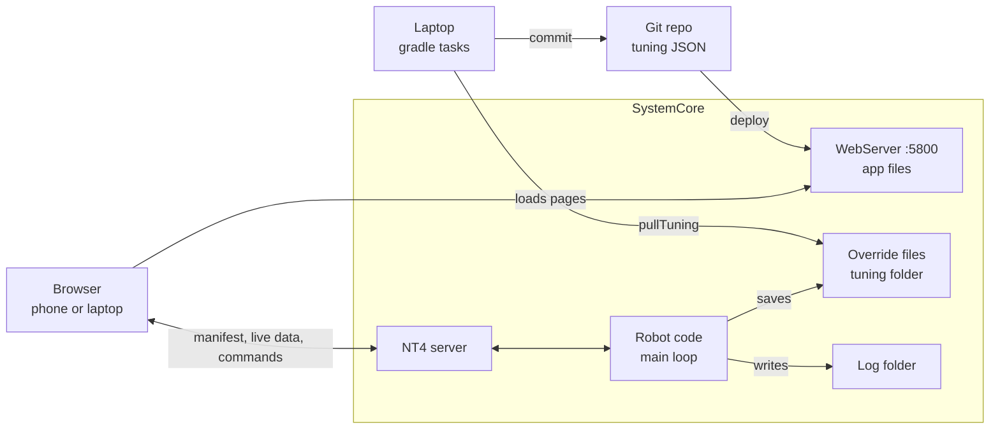
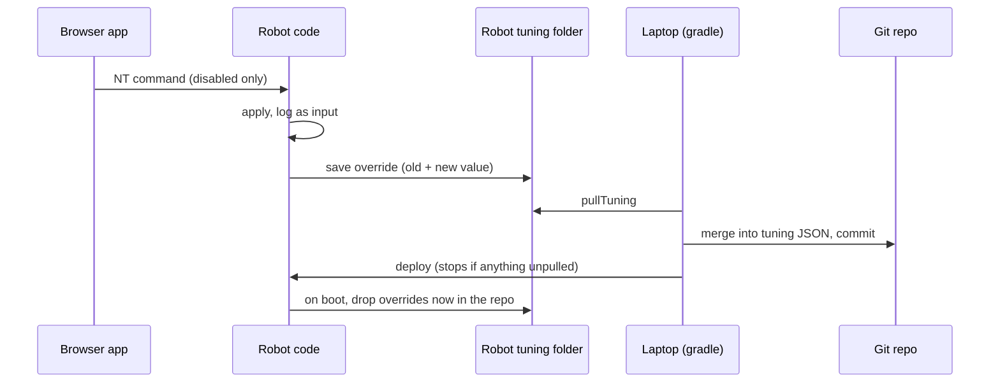

# FM Robot App on SystemCore

Plan from 2026-09-24. Status: agreed direction, no code yet.

## Summary

The FM robot will serve its own pit web app from the SystemCore, as plain HTML and JavaScript files deployed with the robot code. Three rules keep it from going stale the way the old `tools/robot-app` did:

- **The robot serves the app.** Every `./gradlew deploy` ships the app and the code together, so the two always match.
- **The robot describes itself.** Pages read mechanism names, limits, CAN IDs and NT keys from a manifest the code publishes, not from copies kept in the app.
- **The app writes JSON, never Java.** Tuned values land in small data files, and a gradle task pulls them into git.

| Decision | Choice |
| --- | --- |
| Where the app runs | On the robot, from this repo (`src/main/deploy/app/`) |
| Build step | None: plain files, with libraries saved in the repo as single files |
| What a laptop needs | WPILib only (plus Python for the existing `tools/`); no Node |
| How the app changes robot behavior | NT commands, handled by the main loop as logged inputs |
| Camera mounts | Repo JSON is the source of truth, pushed to the cameras, calibrated from field tags |

The code referenced here is on [`port/fm-2027` (PR #1)](https://github.com/Spectrum3847/2026-FM-SystemCore/pull/1) and the PRs built on it. The old app is [`tools/robot-app`](https://github.com/Spectrum3847/2026-Spectrum/tree/2026-offseason-bot/tools/robot-app) on 2026-Spectrum's `2026-offseason-bot` branch.

## Why the old app went stale

Everything that broke was a fact about the robot that the app kept its own copy of. When the robot code changed, the copy didn't.

| The app's own copy | Where it broke on FM-SystemCore |
| --- | --- |
| roboRIO addresses, the `lvuser` account, `/home/lvuser/logs` | SystemCore uses `robot.local`, the `systemcore` user, and `/U/logs` or `/home/systemcore/logs` |
| A rewrite of `configEncoderOffsets(...)` in `OM2026.java` and of the `LimelightConfig` chains in `Vision.java` | FM uses `FM2026.java`, and `VisionConfig` has different fields (`systemCoreCameras`, `orinRobotToCamera`, `robotToQuest`) |
| NT key names under `/Robot/Swerve/Align/` (the old DogLog logging library) | AdvantageKit publishes under `/AdvantageKit/RealOutputs/…`, and `DashboardReceiver` only sends dashboard keys to NT |
| `robot-profile.json` (CAN IDs, current limits) and `controls.json`, mirrored by hand from Java | The drift check reads Java with a custom parser and only shows a warning banner |
| Lived in one repo's `tools/` folder | Wasn't brought over; FM's README lists it as a known gap, and `SwerveAlignment.java` still points at a `tools/swerve-align` that doesn't exist |
| Needed Node, `npm install` and a Vite build on each laptop | Could serve an out-of-date build (its README describes the bug) |

**Worth keeping from it:**

- The browser talks to the robot and cameras directly: NT4 over WebSocket (`nt4.js`) and the Limelights' own HTTP API (`limelight.js`).
- `wpilog.js`, a log reader that runs in both the browser and Node, and `log-model.js`, which finds mechanisms in a log on its own.
- The Power page: current against each motor's limit, time pinned at the limit, battery sag, pack internal resistance, energy per mechanism, and a main-breaker heat simulation.
- The CAN page, and the camera calibration from each camera's accelerometer and an AprilTag solve.
- Tests pinned to real robot data: camera frames from 2026-09-07 and committed match logs.
- The turret page's habit of listing any log key it has no view for, so new checks show up without editing the app.

## Architecture

The robot holds the app, the facts and the live values; the laptop only does git work.



Pages load from the robot, talk to the code over NT, and never touch files; the laptop moves tuned values into git.

### 1. The robot serves the app

- `Robot.java` already calls `WebServer.start(5800, <deploy dir>)` (only when `Constants.hasHardware()`). The app goes in `src/main/deploy/app/` and ships with every deploy.
- Same origin as the robot, so no address probing, no `config.local.json`, no log-folder settings.
- Any laptop with plain WPILib can deploy it. Nothing to install, nothing to build.

### 2. The robot publishes a manifest

Built at startup from objects the code already has, replacing `robot-profile.json`:

- Each `Mechanism`: name, CAN IDs, bus, followers, supply and stator current limits, soft limits.
- Swerve alignment: `SwerveAlignment.KEY_PREFIX` and `MODULE_NAMES`.
- Cameras from `VisionConfig`: names, hosts, mounts.
- The log folder, `LogStorage.folder()` (PR #6), and the robot identity.

It goes on NT for live pages, and into the log once at startup for log pages. It has to be a logged output rather than metadata: AdvantageKit only takes metadata before `Logger.start()`, and the mechanisms don't exist yet. GitSHA, GitDirty and RobotIdentity are already metadata.

For `controls.json`: put a one-line description next to each binding in Java. The wording stays hand-written, as the old README wanted, but sits where anyone editing the binding sees it.

### 3. Tuned values live in JSON

Only the numbers the app writes move out of Java, into `src/main/deploy/tuning/`:

| File | Replaces |
| --- | --- |
| `swerve.json` | `swerve.configEncoderOffsets(...)` in `FM2026.java` |
| `soft-limits.json` | e.g. `minRotations` / `maxRotations` in `Hood.java` |
| `cameras.json` | `systemCoreCameras`, `orinRobotToCamera`, `robotToQuest` and the Limelight mounts in `VisionConfig` |

Everything else stays in Java. The Java rewriters (`swerve-config.js`, `vision-config.js`) and their Spotless workarounds are deleted.

### 4. Changes go through NT, as logged inputs

- AGENTS.md: logic reads only logged inputs, and `Logger` is main-thread only. A web request handled on its own thread would break both.
- `TuneValue` already works this way (it's built on `LoggedNetworkNumber`). Buttons like "Capture offsets" or "Set soft max" publish to NT; the main loop acts on them, so replay sees exactly what happened.
- Changes are refused unless the robot is disabled.
- `nt4.js` is read-only today and needs to publish.

### 5. Git work stays on the laptop

Gradle tasks, matching the existing `ntDump`, `-ProbotLog` and `-ProbotTop`:

- `pullTuning`: copies the robot's overrides into the repo JSON.
- A deploy check: stops if the robot has changes nobody has pulled.
- Log sync to [2026-Robot-Logs](https://github.com/Spectrum3847/2026-Robot-Logs), keeping the old app's headline-numbers `manifest.json`. Gradle or Python, since `tools/` already needs Python.

## Tuning flow

A value tuned in the pit is live on the robot at once, and only becomes permanent when `pullTuning` puts it in git.



1. **Boot.** The code loads the repo's `tuning/*.json` from the deploy folder, then applies overrides from `/home/systemcore/tuning/`.
    - Overrides can't live in the deploy folder: `build.gradle` sets `deleteOldFiles = true` there, so every deploy wipes it.
    - A bad override file raises an alert and falls back to the repo values, so a bad tune can't stop the code from starting.
2. **Tune.** A page sends an NT command while the robot is disabled. The main loop applies it where it can (TalonFX soft limits apply at once; swerve offsets apply on the next code restart). It saves an override that records the new value, the value it replaced, and when.
3. **Replay.** The effective tuning is logged as an input when it loads. Replay on the PC uses the logged values, since the PC has no override files.
4. **Pull.** `./gradlew pullTuning` copies the overrides over SSH and merges them into `src/main/deploy/tuning/*.json`. Review the `git diff` and commit.
    - If the repo value changed since the override was made (its "replaced" value no longer matches), the pull stops and shows both.
5. **Deploy.** A check runs first. If the robot has overrides that aren't in the repo, deploy stops and lists them, for example `hood.softLimitMax 0.137 → 0.141, tuned 9/24`. A flag (e.g. `-PdiscardTuning`) throws them away on purpose.
6. **Clean up.** On the next boot the code deletes overrides that now equal the deployed values.

The existing `eventDeploy` auto-commit on `event*` branches picks up the pulled JSON with no extra step.

## Pages

Most pages port from the old app; soft limits and the on-robot Logs page are new.

| Page | What it does | Writes | Source |
| --- | --- | --- | --- |
| Swerve Align | Live CANcoder angles (already published by `SwerveAlignment` at 20 Hz while disabled). Set wheels straight, press Capture. | `swerve.json`, applied on next restart | Port; keys from the manifest |
| Soft Limits | Robot disabled, motors in coast, move by hand, watch position, press "Set min" / "Set max". Shows observed range from recent logs beside the limits. | `soft-limits.json`, applied to the TalonFX at once | New |
| Cameras | Live view, pitch / roll / height from accelerometer and tag solve, image settings and the auto-tune sweep | `cameras.json`, pushed to cameras | Port |
| Logs | Lists `LogStorage.folder()` with date, size and match; download, zip a day, open in Power or CAN | Nothing | New |
| Power | Current vs limit, time at limit, sag, internal resistance, energy per mechanism, breaker heat | Nothing | Port; limits from the log's manifest |
| CAN | Bus use, error counters, dropouts, device list | Nothing | Port; add SystemCore's native buses (PR #2) |
| Pilot / Operator | Button maps and live controller diagram | Nothing | Port; descriptions from the manifest, joystick data from NT |

The Turret page is dropped (FM has a hood, not a turret), but its "list every key without a view" pattern is reused on every log page.

**Cameras.**

- Repo JSON is the source of truth and `pushLimelightMounts` gets turned on, the same as the offseason robot. This clears the README's pre-event item "verify, then turn it on".
- The tag solve measures pitch, roll and height. Forward, right and yaw need a known robot position; a later "known spot" mode could solve all six with the robot parked on a marked field position.
- Open: also keep exposure, sensor gain and black level in `cameras.json` and push them, so a replacement camera gets the same image settings?

**Logs and power.**

- Logs are read in the browser, in a background worker, so the robot does no parsing. The same pages can open a `.wpilog` from the laptop.
- `MotorInputs` now logs `followerSupplyCurrentAmps[]` and `followerConnected[]`. That removes two of the old README's warnings: leader-only current readings, and dead followers that didn't show up.
- Each log carries its own manifest, so old logs still display correctly after the code changes.

## Plain HTML and JavaScript

Plain files cover everything the old app did. "No build" means no compile step, not no libraries: each library is one file saved in the repo.

### What it can do

- **Code organization:** native JavaScript modules (`import` between files), import maps so `import … from "chart.js"` loads the saved copy, and background workers for parsing big logs.
- **Type checking without TypeScript:** `// @ts-check` plus JSDoc comments. VS Code flags mistakes as you type, and CI runs `tsc --noEmit`.
- **UI:** plain DOM helpers (the old app's `el`, `mountHeader`), Web Components for shared widgets, and Preact + htm or Lit as single files if a page gets complicated.
- **CSS:** custom properties (the theming already uses them), native nesting, grid, container queries, dark mode. No Sass.
- **Graphics:** Chart.js (its single-file build) or uPlot; Canvas and SVG for module dials, the controller diagram and a field view; Three.js if the 3D FM model (`Robot_FM/model.glb`) is ever wanted.
- **Robot and cameras:** NT4 over WebSocket, `fetch` to the robot and to the Limelights' HTTP API, and live video with a plain ``.
- **Files:** open a `.wpilog` from the laptop, save logs, CSV or JSON to the PC, zip a day's logs (one small library such as fflate), cache opened logs in IndexedDB, print a checklist or match report.

### What's blocked from `http://robot.local`

Browsers only allow some features on HTTPS or localhost pages, and the robot's page is neither.

| Blocked | Workaround |
| --- | --- |
| Writing to a folder on the PC | `./gradlew pullTuning` |
| Gamepad API (browsers are restricting it) | Joystick data from SystemCore's system NT server, which also shows what the robot actually receives |
| Copy-to-clipboard API | An older fallback still works |
| Installing as an offline app; keep-screen-on | Not needed; the robot serves the page, and a bookmark works |

If one of these is ever needed, serve the same files from localhost on the laptop with `jwebserver`, which comes with the WPILib JDK.

### What still needs robot code or the laptop

- **Listing files on the robot:** robot code publishes the list over NT, unless WPILib's `WebServer` shows directory listings (check).
- **Changing anything on the robot:** an NT command the main loop handles and logs.
- **SSH and git:** gradle tasks on the laptop.

### Folder layout

```
src/main/deploy/app/
  index.html, styles.css, version.js (stamp written by gradle)
  vendor/   chart.umd.min.js, fonts, other libraries as single files
  lib/      wpilog.js, log-model.js, nt4.js, camera-cal.js, charts.js, ui.js
  pages/    swerve-align/, soft-limits/, cameras/, logs/, power/, can/, controls/
```

The existing `WebServer` serves this at `http://robot.local:5800/app/`. Keep `lib/` logic free of page code, so `node --test` runs the same files in CI.

### The one way plain files can still go stale: the browser cache

After a deploy, a browser may keep running JavaScript it cached earlier.

- Gradle writes `version.js` with the git SHA, from the same info it puts in `BuildConstants`. That's a stamp, not a compile.
- Each page compares its stamp with the `GitSHA` the robot reports. If they differ, it shows "old app cached, press Ctrl+Shift+R".
- Also check whether WPILib's `WebServer` sends `Cache-Control: no-cache`; if it doesn't, the stamp is what catches it.

## Keeping it in sync with AI and human edits

Most drift disappears by design; a CI check on PRs catches the rest, and nothing ever blocks a deploy.

The design removes the old causes: the app parses no Java and keeps no copies of robot facts. It also has no addresses to configure. What's left is the contract between pages and the robot: the manifest fields and log keys each page reads.

**Each page declares what it needs.** A short list at the top of its `main.js` names the manifest fields and log keys it reads. The CI check and the runtime banner both read that list.

**CI check (GitHub Actions, on PRs only).** This keeps the old app's rule that nothing may fail a build or block a deploy.

1. Run the scripted sim: `FM_SIM_SCRIPT=drive ./gradlew simulateJava -PnoSimGui`.
2. Run `log-model.js` in Node against that log and its manifest. Fail if a page's required key is missing, with a message like `power: hood missing SupplyCurrent`.
3. Run the existing tests: committed match logs, camera fixtures, the power math.
4. Run `tsc --noEmit` for the JSDoc types.
5. Later: load each page in Playwright against the sim. `WebServer` only starts when `Constants.hasHardware()`, so either start it in sim too or serve the folder with `jwebserver`.

**Runtime banner.** A page missing something it needs shows a warning and keeps working, like the old app's `/api/drift` banner.

**Rules for AGENTS.md:**

- To add a tuned value, add it to `src/main/deploy/tuning/*.json` and the Java that loads it. Don't touch `app/` for it.
- Never put Java file paths, NT key strings or CAN IDs in `app/`. Read them from the manifest.
- The app changes the robot only through NT commands, handled on the main thread, logged as inputs, and only while disabled.
- New libraries go in `app/vendor/` as single files. No npm, no build step.
- A PR that renames a manifest field or log key a page needs updates that page's list in the same PR.

## Build order

Steps 1–5 are realistic before the October event; 6 and 7 can wait. Build on `port/fm-2027`; the Logs page needs `LogStorage` from PR #6. One feature per PR, per AGENTS.md.

- [ ] **1. Trial run.** Convert Swerve Align to plain files in `src/main/deploy/app/`, served by the existing `WebServer`, with its keys from a minimal manifest. Confirm port 5800, phone access and cache headers.
- [ ] **2. Manifest.** Build it from `Mechanism`, `SwerveAlignment`, `VisionConfig` and `LogStorage`. Publish on NT and log it once at startup.
- [ ] **3. Tuning JSON.** `swerve.json`, `soft-limits.json`, `cameras.json`; the loader with overrides and the bad-file alert; NT commands; the effective tuning logged as an input. Turn on `pushLimelightMounts`.
- [ ] **4. Laptop tasks.** `pullTuning` and the deploy check.
- [ ] **5. Pit pages.** Soft Limits, Cameras (port), and Logs with downloads.
- [ ] **6. Log pages.** Port Power and CAN, with SystemCore's native buses.
- [ ] **7. Upkeep.** The CI check, the AGENTS.md rules, log sync to 2026-Robot-Logs, and the Pilot / Operator page.

## Check on the bench first

None of these should change the plan, but each one could change a detail, so check them during step 1.

- [ ] **Port 5800.** A [SystemCore teardown](https://dunkirk.sh/blog/frc-systemcore-image/) lists a built-in CAN sniffer on 5800. Confirm our `WebServer` really serves there (for example, Elastic loads its layout from the robot).
- [ ] **`WebServer` behavior.** Does it send `Cache-Control: no-cache`? Does it list directories? The second decides how much robot code the Logs page needs.
- [ ] **SystemCore cameras.** Do `limelightsc0/1` answer the same Limelight HTTP API on port 5807 as standalone Limelights?
- [ ] **Joystick data.** Which topics on SystemCore's system NT server carry Driver Station joystick data, for the controller page.
- [ ] **CPU headroom.** The README measured the bench unit at 80–90% busy, with SystemCore's own vision servers using about 55%. Watch loop time with a page open and a log download running (`-ProbotTop`).
- [ ] **Log folder.** Where logs land with and without a USB stick, and whether the web server can read that folder.

## Sources

- [Old `tools/robot-app` README](https://github.com/Spectrum3847/2026-Spectrum/blob/2026-offseason-bot/tools/robot-app/README.md) (2026-Spectrum, `2026-offseason-bot`)
- [FM-SystemCore PR #1, `port/fm-2027`](https://github.com/Spectrum3847/2026-FM-SystemCore/pull/1)
- [Reverse engineering the FRC SystemCore image](https://dunkirk.sh/blog/frc-systemcore-image/) (ports and services)
